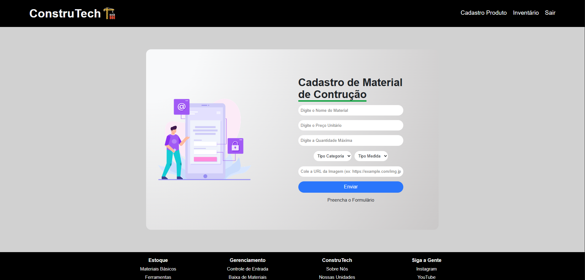
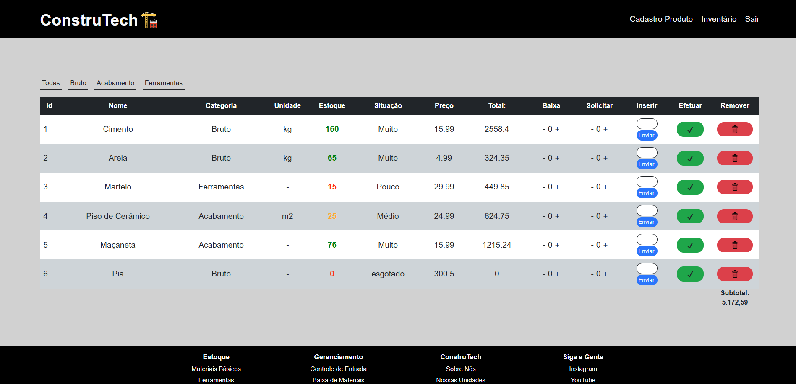

# Constru Tech

Sistema de gerenciamento local de produtos, de uma loja de materiais de construção.
O sistema permite adicionar produtos no estoque, dar baixa e solicitar produtos, efetuar a ação, nesse sistema possui cadastro de produtos: nome, preço, categoria, imagem, entre outros, permite o dono ter total controle dos produtos.

## Tecnologias:
- HTML
- CSS
- JavaScript
- PHP

## Funcionalidades:
- Login do Responsável
- Adição de produtos
- Visualização de produtos
- Exclusão de produtos
- Controle de estoque
- Filtro por categoria

## Como Rodar
1. Clonar repositório
2. Abra em um servidor local+++++
3. Coloque a pasta dentro do diretório do servidor
4. Execute no navegardor:
```bash
https://github.com/daniellbp2005/ConstruTech
```

## Preview do Sistema

### Tela de Login


### Tela de Cadstro de Produto


### Tela de Inventário

